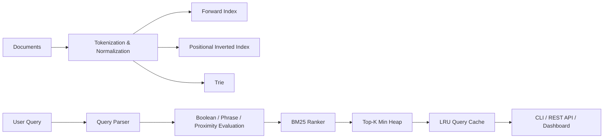
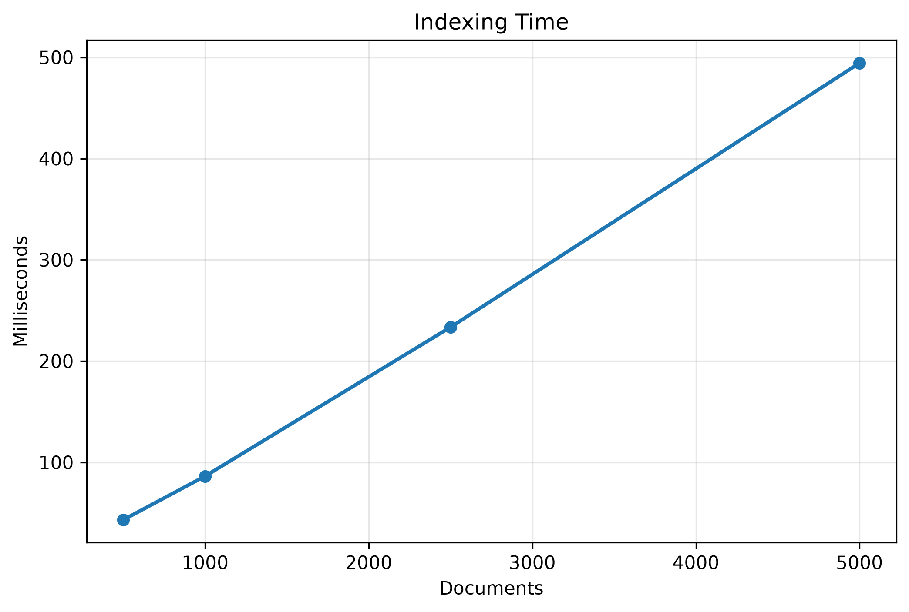
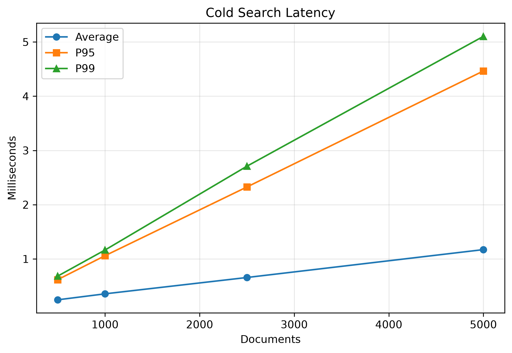
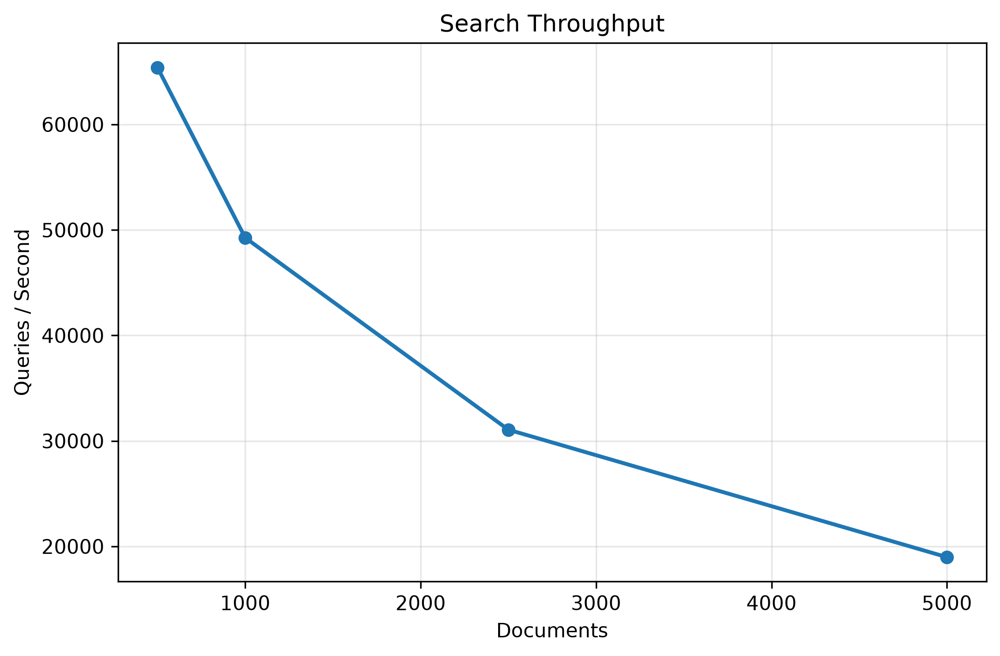

# FastSearch

<p align="center">

**An in-memory search engine built in modern C++17 implementing core Information Retrieval techniques including BM25 ranking, positional indexing, Boolean search, phrase search, proximity search and query optimization.**

</p>

<p align="center">

</p>

---

# Overview

FastSearch is an educational Information Retrieval engine built completely from scratch in **modern C++17**.

The goal of the project is to demonstrate how modern search engines work internally by implementing the core indexing, retrieval and ranking algorithms instead of relying on existing search libraries.

The engine supports positional indexing, BM25 ranking, Boolean retrieval, phrase and proximity search, autocomplete, spell correction, REST APIs, performance benchmarking and an interactive web dashboard.

---

# Why FastSearch?

Modern search systems are far more than simple string matching.

FastSearch explores the complete retrieval pipeline including:

* Efficient document indexing
* Query parsing and optimization
* Ranking using BM25
* Positional retrieval
* Low-latency search
* Query caching
* Performance benchmarking

The project is intentionally lightweight, dependency-free (except the standard library) and focused on implementing the underlying algorithms from scratch.

---

# Features

## Information Retrieval

* Forward Index
* Positional Inverted Index
* BM25 Ranking
* Top-K Retrieval using Min Heap

## Search

* Keyword Search
* Boolean Search
* Phrase Search
* Proximity Search

Example queries

```text
machine learning

"machine learning"

machine AND backend

machine OR operating

machine NEAR/2 learning
```

---

## Query Processing

* Query Parser
* Text Normalization
* Stop-word Handling
* Posting List Ordering
* Phrase Verification
* Proximity Verification

---

## Autocomplete

Trie-based autocomplete supporting

* Prefix search
* Frequency ranking
* Fast suggestions

---

## Spell Correction

Levenshtein-distance based spell correction with Trie candidate generation.

Example

```text
machien
↓
machine
```

---

## Performance

* LRU Query Cache
* Metrics Collector
* Benchmark Suite
* Search Throughput Measurement
* Latency Statistics
* P95 / P99 Reporting

---

## Interfaces

* Command Line Interface
* REST API
* Interactive Web Dashboard

---

# Architecture



---

# Components

| Component        | Responsibility                                                 |
| ---------------- | -------------------------------------------------------------- |
| ForwardIndex     | Stores original documents for retrieval and snippet generation |
| PositionalIndex  | Stores positional postings for phrase and proximity search     |
| QueryParser      | Parses and validates user queries                              |
| BM25Ranker       | Scores candidate documents                                     |
| Trie             | Prefix autocomplete                                            |
| SpellCorrector   | Levenshtein-based correction                                   |
| LRUCache         | Query result caching                                           |
| MetricsCollector | Latency and cache statistics                                   |
| BenchmarkRunner  | Performance benchmarking                                       |

---

# Indexing Pipeline

```
Documents
  │
  ▼
Tokenization
  │
  ▼
Normalization
  │
  ▼
Forward Index
  │
  ▼
Positional Inverted Index
  │
  ▼
Trie
  │
  ▼
Ready for Search
```

---

# Query Execution Pipeline

```
User Query
   │
   ▼
Query Parser
   │ 
   ▼
Posting Retrieval
   │ 
   ▼
Boolean / Phrase / Proximity Evaluation
   │ 
   ▼
BM25 Ranking
   │ 
   ▼
Top-K Heap
   │ 
   ▼
LRU Cache
   │ 
   ▼
Search Results
```

---

# REST API

| Method | Endpoint                | Description                                |
| ------ | ----------------------- | ------------------------------------------ |
| GET    | `/search?q=`            | Returns ranked search results              |
| GET    | `/autocomplete?prefix=` | Returns autocomplete suggestions           |
| POST   | `/upload`               | Uploads a new in-memory document           |
| POST   | `/rebuild`              | Rebuilds the index from the data directory |
| GET    | `/metrics`              | Returns engine statistics                  |

---

# Project Structure

```text
FastSearch
│
├── api/                    REST API implementation
├── benchmarks/
│   ├── corpus/
│   ├── plots/
│   └── benchmark.cpp
│
├── data/                   Sample documents
├── frontend/               HTML/CSS/JS dashboard
├── include/                Public headers
├── scripts/                Benchmark plotting utilities
├── src/                    Core implementation
├── tests/                  Unit tests
│
├── CMakeLists.txt
└── README.md
```

---

# Performance Benchmarks

The benchmark suite evaluates the engine using

* ~500 technical paragraphs
* 80 representative search queries
* Dataset sizes of **500**, **1000**, **2500** and **5000** documents

Metrics collected include

* Indexing latency
* Cold search latency
* Warm search latency
* Autocomplete latency
* Spell correction latency
* Search throughput (queries/second)

Cold search invalidates the LRU query cache before every query.

Warm search executes repeated queries with caching enabled.

---

## Indexing Performance

<p align="center">

</p>

---

## Cold Search Latency

<p align="center">

</p>

---

## Search Throughput

<p align="center">

</p>

---

# Complexity

| Operation          | Complexity                  |
| ------------------ | --------------------------- |
| Indexing           | **O(T)**                    |
| Term Lookup        | **O(1)** average            |
| Boolean Search     | **O(sum of posting lists)** |
| Phrase Search      | **O(candidate positions)**  |
| BM25 Top-K Ranking | **O(n log k)**              |
| Trie Autocomplete  | **O(prefix + matches)**     |
| LRU Cache          | **O(1)** average            |

---

# Design Trade-offs

The engine stores the original document in a forward index to enable snippet generation and result presentation.

A positional inverted index consumes more memory than a frequency-only index but enables efficient phrase and proximity search.

The system is intentionally in-memory to prioritize low-latency retrieval and implementation clarity.

---

# Build

```bash
cmake -S . -B build

cmake --build build

ctest --test-dir build --output-on-failure
```

---

# Run

CLI

```bash
./build/fastsearch_cli data
```

REST API

```bash
./build/fastsearch_api data 8080
```

Benchmark Suite

```bash
./build/fastsearch_benchmark
```

Open the dashboard

```
http://localhost:8080
```

---

# Tech Stack

| Category      | Technology                         |
| ------------- | ---------------------------------- |
| Language      | C++17                              |
| Build System  | CMake                              |
| Backend       | Custom HTTP Server (POSIX Sockets) |
| Frontend      | HTML, CSS, JavaScript              |
| Testing       | CTest                              |
| Benchmarking  | Custom Benchmark Framework         |
| Visualization | Python (Matplotlib, Pandas)        |

---

# Design Decisions

* BM25 replaces TF-IDF for improved document ranking.
* Positional indexing enables efficient phrase and proximity retrieval.
* Posting lists are reordered before intersection to reduce work during Boolean evaluation.
* Query results are cached using an LRU cache to accelerate repeated searches.
* A forward index stores original document text for snippet generation.
* The engine is fully in-memory to simplify the architecture and minimize query latency.

---

# Future Improvements

* Incremental indexing
* Persistent storage
* Compressed posting lists
* Parallel indexing
* Parallel query execution
* Distributed search
